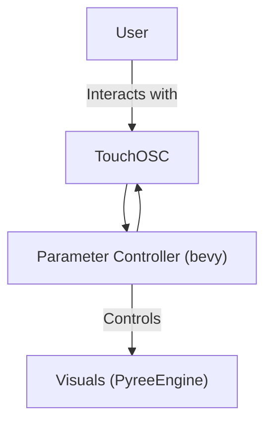

# VJPyree-GPN20
Howdy 🤠

This is the code for the VJ Pyree GPN20 visuals.

## OSC data flow diagram

```mermaid
graph TD;

user[User] -->|Interacts with| touchosc;
touchosc[TouchOSC] --> bevy["Parameter Controller (bevy)"];
bevy --> touchosc;
bevy -->|Controls| pyree["Visuals (PyreeEngine)"]
```