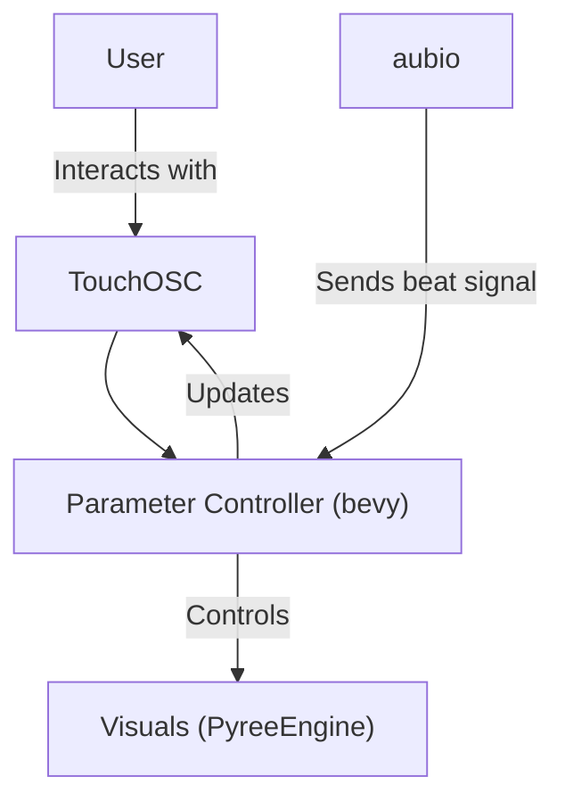

# VJPyree-GPN20
Howdy 🤠

This is the code for the VJ Pyree GPN20 visuals.

## OSC data flow diagram



## Aubio
[aubio-beat-osc](https://github.com/DrLuke/aubio-beat-osc) is used for beat detection. Run:
```bash
aubio-beat-osc -c 127.0.0.1 31337 /beat -v
```
(Warning: doesn't work on Python 3.10 or newer)